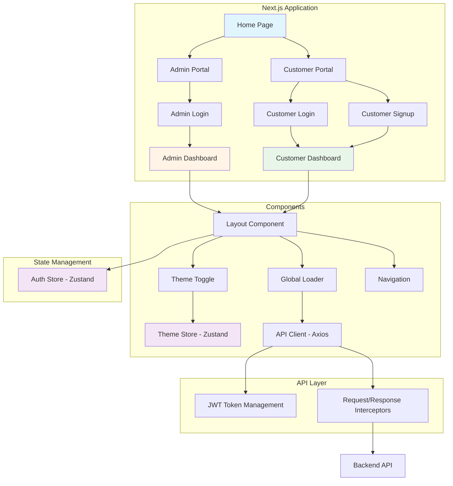
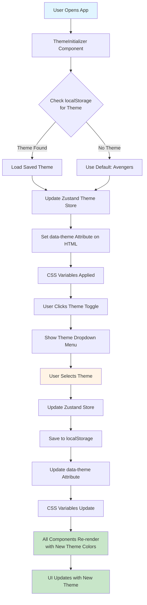
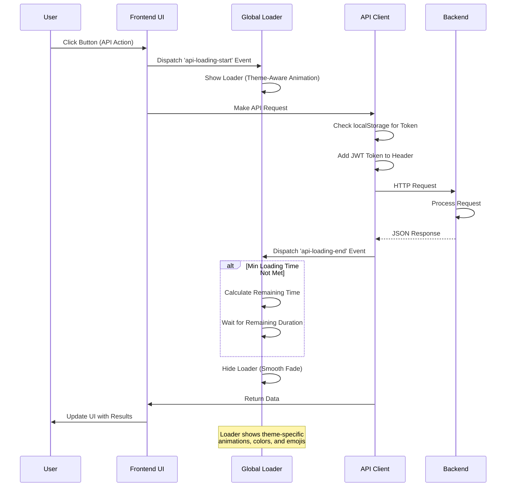
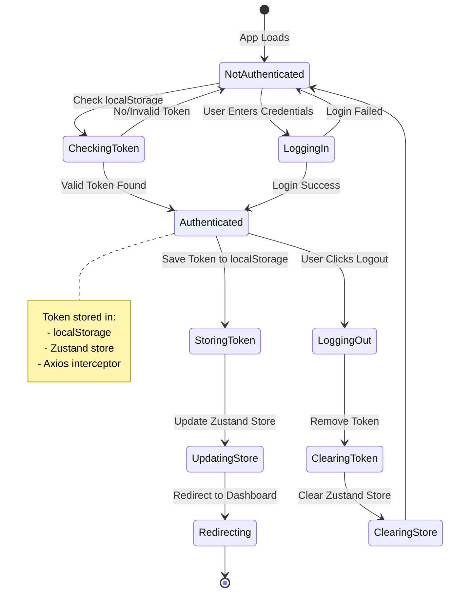
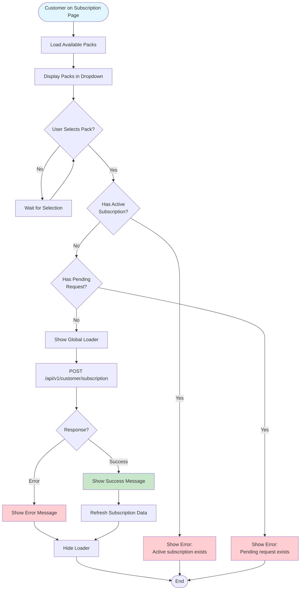
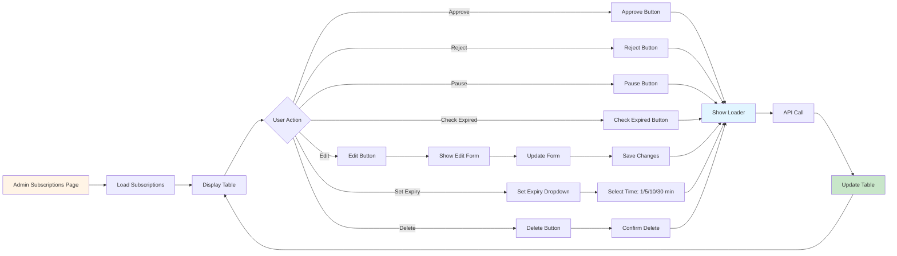
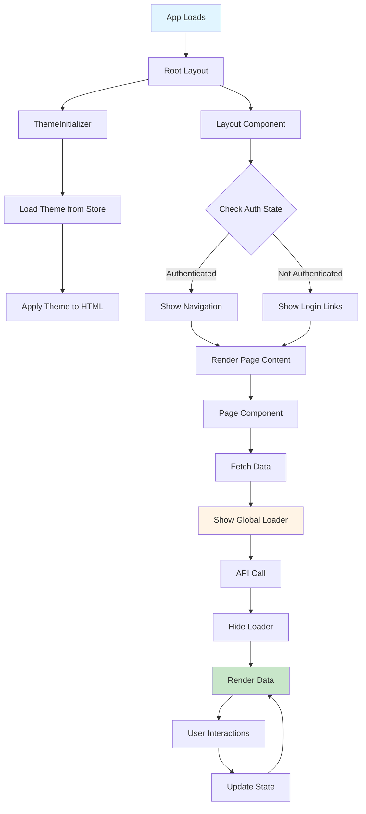
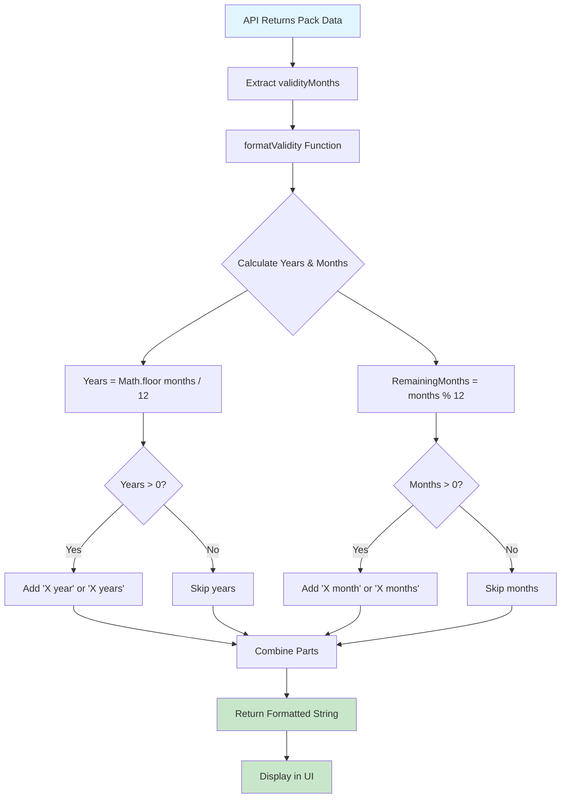
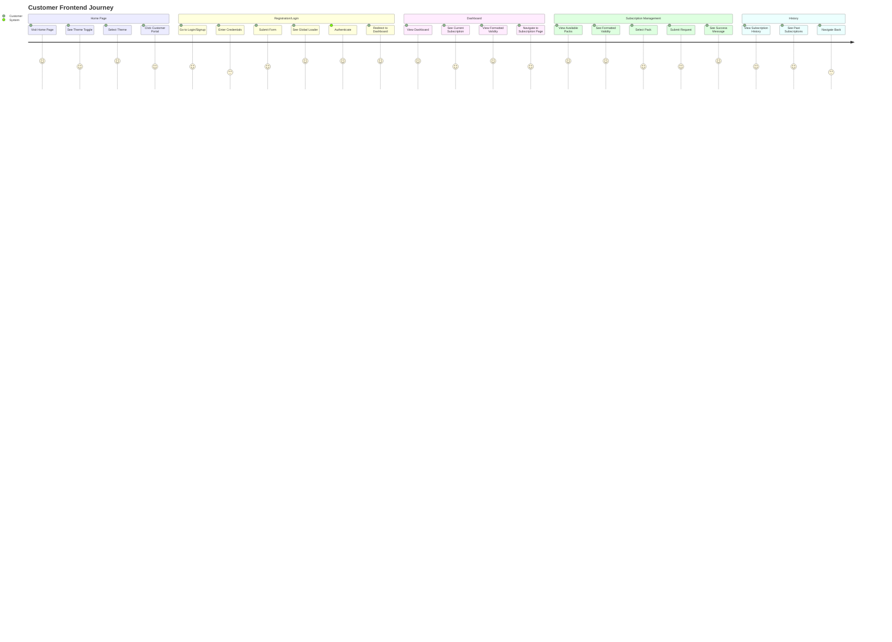
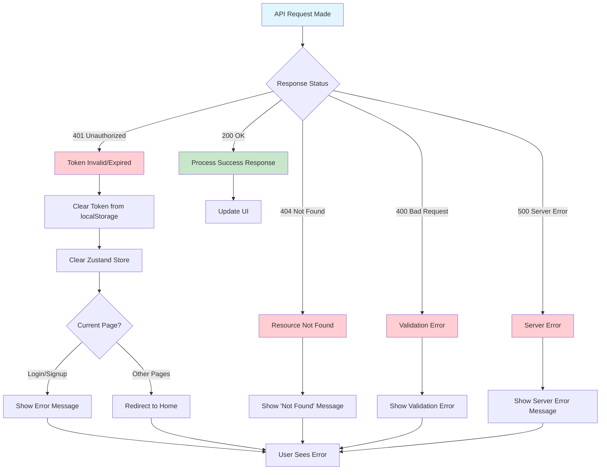

# Frontend - Flow Diagrams

This document contains Mermaid flow diagrams specific to the frontend application.

## Frontend Architecture

## Theme System Flow

## API Request Flow with Global Loader

## Authentication State Management

## Customer Subscription Request Flow

## Admin Subscription Management UI Flow

## Component Rendering Flow

## Validity Formatting Flow

## Complete Customer User Journey

## Error Handling Flow

